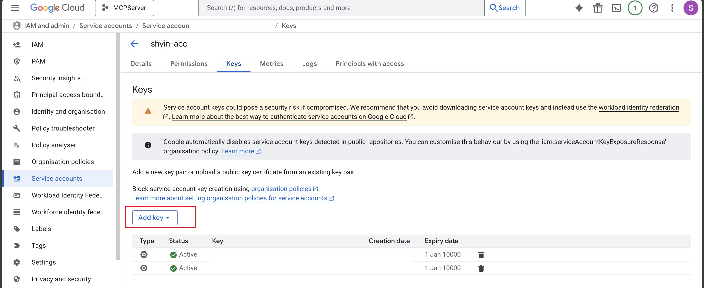
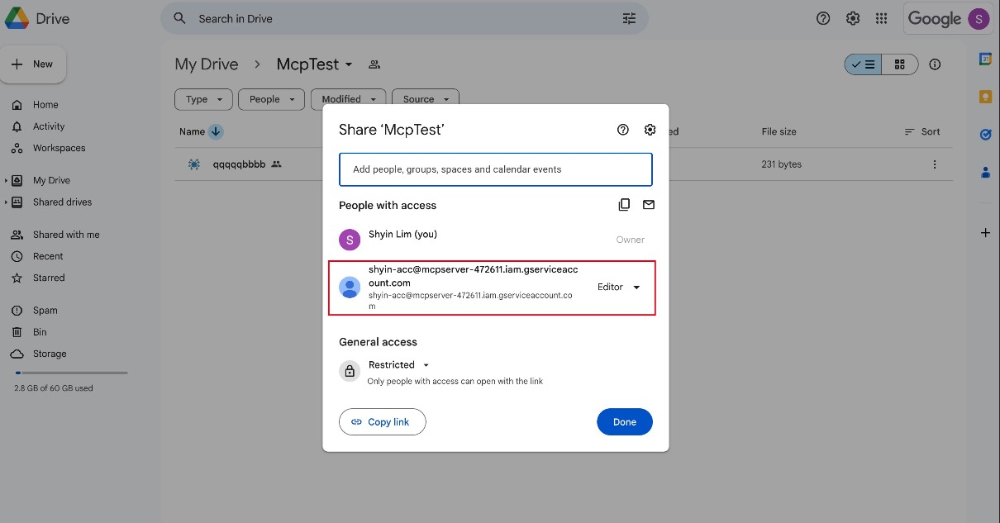

# MindMup2 Google Drive MCP Server

A Model Context Protocol (MCP) server that lets AI clients (Claude Code, Cursor) **search, read, and drill into [MindMup 2](https://drive.mindmup.com/) `.mup` mind maps stored in Google Drive** — without dumping a 3MB JSON tree into the model. Large maps are auto-summarised into a tree outline; the AI then drills into specific sections by `node_path`.

> **Compatibility:** Claude Code, Cursor (HTTP transport).
> **Not supported:** Claude Desktop (stdio-only).

## 💫 Result


## ✨ Features

- **Search MindMup files** across your entire Google Drive (read-only)
- **Tree navigation + section drill-down** for large mind maps — small files return full content, large files return an outline you can drill into
- **Per-client cache isolation** via `X-Client-Id` header, so different users/tools don't share cached content
- **Hot-reload dev mode** via `fastmcp run --reload` + bind-mounted source
- **FastMCP server** with built-in `/health` and `/ping` endpoints
- **Docker Compose** for both dev and prod

## 🗺️ End-to-End Flow

```
1. Set up Google Cloud service account     →  download JSON key
2. Share your Drive folder with the SA     →  Viewer access
3. Base64-encode the JSON key              →  for X-Google-Credential header
4. Run the server  (Docker or Python)      →  http://127.0.0.1:9805
5. Configure your MCP client (Claude/Cursor) with the base64 credential
6. Verify  →  curl http://127.0.0.1:9805/health
```

## 🔧 Available MCP Tools

| Tool | Description |
|------|-------------|
| `list_files` | List MindMup files from Google Drive (folders and non-`.mup` filtered by default). Returns `id`, `name`, `folder_url`, `size`, `modified_time`. |
| `read_mindmap` | Read a MindMup file by `file_id` **or** `file_name` (one required; name uses first partial match). Small files (<100KB AI-dict) return `content_type: "full"`. Large files return `content_type: "outline_only"` with `tree_outline`, `section_stats`, and `suggested_start_paths`. |
| `search_mindmap` | Search nodes by keyword. Params: `file_id`, `keyword`, optional `node_path` (subtree scope), `max_results=30`, `normalize_whitespace=True`. Returns nodes with `node_path`, `title_preview`, `breadcrumb`, `children_count`. |
| `get_mindmap_section` | Drill into a section by `node_path` (dotted integers, root is `1`, e.g. `"1.2.3"`). Optional `max_depth`, `offset=0`, `limit=0`. Returns `content_type: "full" \| "outline_only" \| "paginated" \| "truncated"` — auto-switches when the section is still too large. |

**Suggested workflow for AI agents:** `list_files` → `read_mindmap` → if `outline_only`, either `search_mindmap` (by keyword) or `get_mindmap_section` (by `node_path` from `suggested_start_paths`).

## 🚀 Getting Started

### Prerequisites

- Python 3.12+
- Docker & docker-compose (required for `make run-dev-docker` / `make run-prod`)
- Google Cloud Platform account
- An MCP client that supports HTTP transport (Claude Code or Cursor)

### Google Drive API Setup

| Step | Description                                                                                                                                                                                                                                          | Image |
|------|----------------------------------------------------------------------------------------------------------------------------------------------------------------------------------------------------------------------------------------------------|-------|
| 1 | Go to [Google Cloud Console](https://console.cloud.google.com/) and create a new project (free tier is fine — no billing required for Drive API).                                                                                                  |       |
| 2 | Enable the [Google Drive API](https://console.cloud.google.com/apis/library/drive.googleapis.com).                                                                                                                                                  |       |
| 3 | Create Service Account credentials:<br>- "IAM & Admin" → "Service Accounts" → "Create Service Account"<br>- **No project-level role needed** (Drive sharing handles auth)<br>- Open the SA → "Keys" tab → "Add Key" → JSON → download the key file. |  |
| 4 | Base64-encode the entire JSON key file (see [Header Reference](#header-reference)).<br>⚠️ **Add the JSON file to `.gitignore`** — never commit it.                                                                                                  |       |
| 5 | Share your Google Drive folder with the SA:<br>- Copy the `client_email` value from the JSON<br>- Right-click the folder → Share → paste the email<br>- Grant **Viewer** access, **uncheck** "Notify people"<br>- Sharing propagates to subfolders. |  |

> **Note on scopes:** The server requests `auth/drive` + `auth/drive.file`. Despite the broad scope, with `Viewer` folder-level sharing the SA can only read what you've shared. Workspace-managed accounts may block external sharing — if so, ask your admin to allow service-account sharing for your domain.

### Run the Server

**Docker (recommended):**

```bash
make run-dev-docker   # dev: hot-reload, source bind-mounted
make run-prod         # prod: no reload
```

**Direct Python (no Docker):**

```bash
pip install -r requirements.txt
python3 run.py
# Optionally: MCP_TRANSPORT=streamable-http python3 run.py
```

### Verify the Server

```bash
curl http://127.0.0.1:9805/health
# => {"result":"success","time":"...","message":"MCP server is running. ..."}
```

If you don't get `success`, check `docker logs <container>` (Docker mode) or stdout (Python mode).

### Run Tests

```bash
pip install -r requirements.txt
pytest
```

### MCP Client Configuration

Add to your MCP client config (`~/.claude/mcp.json` for Claude Code, or your Cursor MCP settings):

```json
{
    "mcpServers": {
        "mindmup-gdrive": {
            "type": "http",
            "url": "http://127.0.0.1:9805/mcp",
            "headers": {
                "X-Google-Credential": "ewogICJ0eXBlIjogInNlcnZpY2VfYWNjb3VuXXXXXXXXXXX",
                "X-Client-Id": "shyin-claude-code"
            }
        }
    }
}
```

#### Header Reference

| Header | Required | Description |
|--------|----------|-------------|
| `X-Google-Credential` | ✅ | Your service account JSON, base64-encoded. Use [base64encode.org](https://www.base64encode.org/) and paste the output here. ⚠️ Base64 is **encoding, not encryption** — the MCP client config sits in plaintext on disk, so don't sync it to public repos / unencrypted cloud backups. |
| `X-Client-Id` | Optional | A unique identifier per user + tool, e.g. `shyin-claude-code`. Used as part of the cache key `(X-Client-Id, credential_hash, file_id)` to isolate cached content across clients. If omitted, falls back to `default` (cache may be shared with other unset clients) and a warning is logged. Recommended format: `<your-name>-<tool-name>`. Use a high-entropy value to avoid collisions with other users. |

## 🩺 Troubleshooting

| Symptom | Likely cause / fix |
|---------|--------------------|
| `health` returns nothing / connection refused | Server not running. Check `docker ps` or stdout. Port 9805 already in use? Edit `mcp_deployment/docker-compose-dev.yml` to remap. |
| `Google Drive authentication failed` | Invalid base64. Sanity check: `echo "$CRED" \| base64 -d \| jq .client_email` — should print the SA email. |
| `list_files` returns empty | (a) Folder shared with the wrong email — must match `client_email` in the JSON. (b) Files aren't `.mup` — call with `mindmup_only=False` to confirm visibility. (c) Workspace org policy blocks external sharing. |
| Docker build fails | Make sure Docker daemon is running. Re-run `make run-dev-docker`. |
| Changes not picking up in dev | Hot-reload only watches Python source. Restart the container after dependency or env changes. |

## 🏗️ Project Structure

<details>
<summary>Click to expand</summary>

```text
├── mcp_deployment/
│   ├── docker-compose-dev.yml
│   ├── docker-compose-prod.yml
│   └── Dockerfile
├── src/
│   ├── core/
│   │   ├── gdrive_client.py    # Google Drive API client
│   │   ├── gdrive_feature.py   # Google Drive feature implementation
│   │   ├── mcp_server.py       # Main MCP server with read tools
│   │   └── mindmup_parser.py   # MindMup parsing + tree navigation
│   ├── model/
│   │   ├── common_model.py     # Common data models
│   │   ├── gdrive_model.py     # Google Drive data models
│   │   └── mindmup_model.py    # Mind map data models (with to_ai_dict)
│   └── utility/
│       ├── enum.py             # Enumerations and constants
│       └── logger.py           # Logging utilities
├── tests/                      # Unit tests
├── plans/                      # Implementation plans
├── run.py                      # Main entry point
├── requirements.txt            # Python dependencies
└── makefile                    # Build and deployment commands
```

</details>
